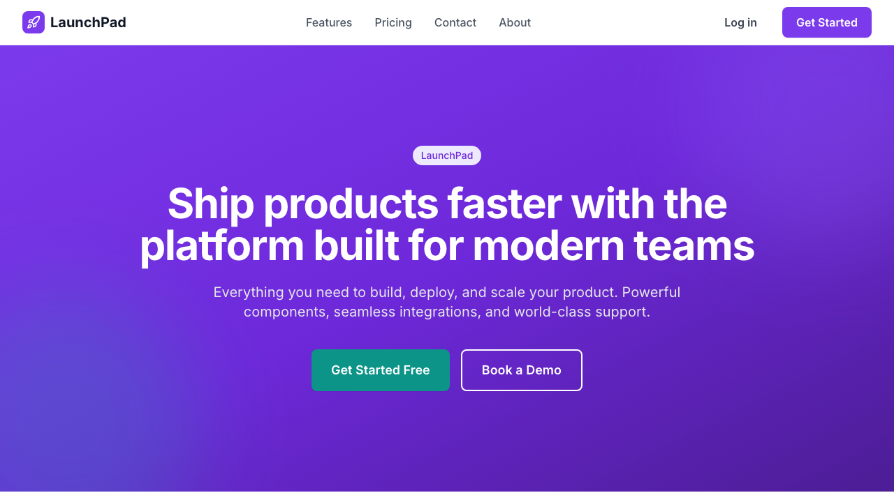

# Decoupled Components - Astro



An **Astro** starter template for [Decoupled.io](https://decoupled.io) - headless Drupal with a visual editor. This is the Astro port of [decoupled-components](https://github.com/nextagencyio/decoupled-components) (Next.js).

## Why Astro?

- **Zero JS by default** - Paragraph components ship zero JavaScript to the browser
- **Islands architecture** - Only interactive parts (editor, mobile menu, newsletter form) hydrate
- **Faster page loads** - Static HTML with selective hydration
- **Same Drupal backend** - Works with the exact same Decoupled.io CMS

## Quick Start

```bash
npm install
npm run setup      # Interactive wizard - creates Drupal space + imports content
npm run dev        # Start dev server at localhost:4321
```

Or run in **demo mode** (no Drupal needed):

```bash
npm install
npm run dev        # Uses mock data automatically
```

## Architecture

```
src/
  components/
    paragraphs/              # Astro components (zero JS)
      ParagraphHero.astro
      ParagraphCardGroup.astro
      ParagraphSidebyside.astro
      ParagraphAccordion.astro    # Uses <details> for interactivity
      ParagraphQuote.astro
      ParagraphPricing.astro
      ParagraphLogoCollection.astro
      ParagraphStats.astro
      ParagraphNewsletter.astro   # Inline script for form
      ParagraphText.astro
      ParagraphRenderer.astro     # Switch/router
    ui/                      # Astro UI primitives
    Header.astro             # Inline script for mobile menu
    Footer.astro
  layouts/
    BaseLayout.astro         # Root HTML
    SiteLayout.astro         # Header + Footer wrapper
  pages/
    index.astro              # Homepage
    [...slug].astro          # Dynamic pages
    404.astro
lib/                         # Shared utilities
  drupal-client.ts           # TypedClient factory
  mock-client.ts             # Demo mode client
  types.ts                   # Paragraph type definitions
  canvas.ts                  # Drupal Canvas page loader
  canvas-props.ts            # Canvas prop -> paragraph prop adapters
schema/                      # Auto-generated (do not edit)
data/
  components-content.json    # Content model (single source of truth)
  mock/                      # Demo mode data
```

## Key Differences from Next.js Version

| Feature | Next.js | Astro |
|---------|---------|-------|
| Rendering | React Server Components | Astro components (zero JS) |
| Interactivity | `'use client'` on every component | Islands (`client:load`, `client:only`) |
| Accordion | React `useState` | Native `<details>` element |
| Mobile menu | React `useState` | Inline `<script>` |
| Newsletter form | React `useState` | Inline `<script>` |
| API routes | `app/api/*/route.ts` | `src/pages/api/*.ts` |
| Env vars | `NEXT_PUBLIC_*` | `PUBLIC_*` |
| CSS loading | `next/font` | `<link>` tag |
| Image optimization | `next/image` | Native `` |

## 10 Component Sections

All built as zero-JS Astro components:

1. **Hero** - Title, subtitle, CTAs, gradient/dark/image backgrounds
2. **Card Group** - Feature cards in 2-4 column grid with icons
3. **Side by Side** - Image + content with feature list
4. **Accordion** - Collapsible FAQ using `<details>` (no JS)
5. **Testimonials** - Quote cards with star ratings
6. **Pricing** - Tier comparison with featured highlighting
7. **Logo Collection** - Partner/tech logos with hover effects
8. **Stats** - Key metrics grid
9. **Newsletter** - Email signup with progressive enhancement
10. **Text Block** - Rich HTML content with CTA

## Visual editing with Drupal Canvas

Pages are built in the Drupal Canvas editor (`/canvas` on the Drupal site, which
needs the `dc_canvas` module). Canvas embeds this app as its live preview and syncs
its component library from it, using `@drupal-canvas/headless-astro`.

- **Components:** `src/canvas/<machine_name>/{component.yml,index.astro}`. There are
  10 sections plus 7 child items (cards, FAQ items, testimonials, pricing tiers,
  logos, stats, features), which go into their parent's slot. Each `index.astro` is
  a thin wrapper around the same `src/components/paragraphs/*` markup that renders
  GraphQL paragraph pages, so there is one source of markup.
- **Routing:** `[...slug].astro` and `index.astro` try Canvas first (`lib/canvas.ts`,
  which is draft-aware) and fall back to GraphQL landing pages. The homepage is the
  Drupal front page, or a Canvas page with the alias `/home`.
- **Injected routes:** `/api/draft`, `/api/draft/renew`, `/api/disable-draft`,
  `/api/canvas/components` and `/api/canvas/jsonapi/*`. These, plus the CSP
  `frame-ancestors` header for the editor iframe, come from the integration.
- **Adding a component:** create `src/canvas/<name>/component.yml` and `index.astro`,
  then reload the Canvas editor to sync it.
- **Shared definitions:** the `component.yml` files are shared with the Next.js
  starter (`decoupled-components`) and must stay identical, because Canvas refuses to
  sync a component whose definition differs between two frontends of one site.
  `npm run check:canvas` compares them against a sibling checkout; CI runs it too.
- **Env:** `CANVAS_SITE_URL` defaults to `DRUPAL_BASE_URL`. Draft preview needs SSR
  and a Chromium browser, because the preview cookie is partitioned.

## Environment Variables

```env
# Drupal Backend
DRUPAL_BASE_URL=https://your-space.decoupled.website
DRUPAL_CLIENT_ID=your-client-id
DRUPAL_CLIENT_SECRET=your-client-secret
# Demo Mode (default: true)
PUBLIC_DEMO_MODE=true

```

## Scripts

```bash
npm run dev            # Start dev server
npm run build          # Production build
npm run preview        # Preview production build
npm run setup          # Interactive setup wizard
npm run setup-content  # Import content model to Drupal
npm run sync-schema    # Regenerate TypeScript types from Drupal
```

## Rendering & Caching

Astro runs in **SSR mode** (`output: 'server'`) — every request fetches fresh content from Drupal via GraphQL. No revalidation webhooks needed.

- Content updates are **instant** — no cache to invalidate
- Astro renders HTML via string concatenation (faster than React SSR)
- Zero JS shipped to the browser means instant paint with no hydration step
- For production, put a CDN (Cloudflare, Netlify Edge) in front for edge caching

## Deployment

The starter auto-detects your platform and uses the right adapter — no config changes needed.

### Netlify

Connect your repo in the Netlify dashboard. It reads `netlify.toml` automatically.

Required env vars: `DRUPAL_BASE_URL`, `DRUPAL_CLIENT_ID`, `DRUPAL_CLIENT_SECRET`, `PUBLIC_DEMO_MODE=false`

### Cloudflare

```bash
npm run build:cloudflare   # DEPLOY_TARGET=cloudflare astro build
npx wrangler deploy        # or `npx wrangler dev` to run the worker locally
```

Cloudflare Pages and Workers Builds are detected automatically (`CF_PAGES`,
`WORKERS_CI`). Set the Drupal variables as Worker vars/secrets (`.dev.vars` locally).
`wrangler.jsonc` needs `nodejs_compat`, which the Canvas draft routes rely on.

### Vercel

Import your repo in the Vercel dashboard. Framework preset: **Astro**.

Required env vars: same as above.

### Docker / VPS

```bash
npm run build
node dist/server/entry.mjs   # Runs on port 4321
```

### How auto-detection works

`astro.config.mjs` checks environment variables set by each platform:
- `NETLIFY=true` → uses `@astrojs/netlify` (serverless functions)
- `VERCEL=1` → uses `@astrojs/vercel` (serverless functions)
- Neither → uses `@astrojs/node` (standalone server)

## Resources

- [Decoupled.io](https://decoupled.io) - Headless Drupal platform
- [Astro Docs](https://docs.astro.build)
- [Drupal Canvas](https://www.drupal.org/project/canvas) - Visual page builder
